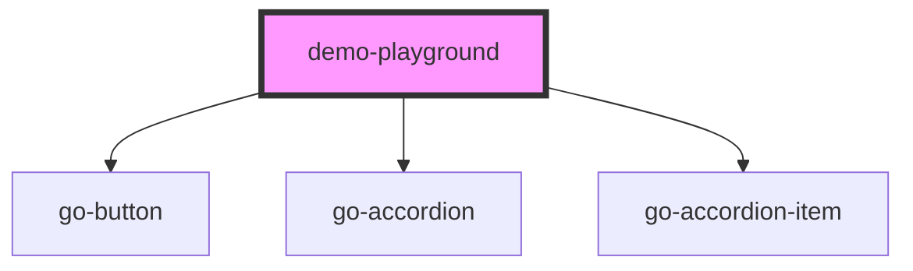

## demo-playground API

<!-- Auto Generated Below -->

## Properties

| Property | Attribute | Description                                        | Type                | Default     |
| -------- | --------- | -------------------------------------------------- | ------------------- | ----------- |
| `block`  | `block`   |                                                    | `boolean`           | `false`     |
| `props`  | `props`   |                                                    | `IProp[] \| string` | `undefined` |
| `slots`  | `slots`   |                                                    | `ISlot[] \| string` | `undefined` |
| `tag`    | `tag`     | query selector for the component to apply props to | `string`            | `null`      |

## Events

| Event    | Description | Type                       |
| -------- | ----------- | -------------------------- |
| `loaded` |             | `CustomEvent<HTMLElement>` |

## Dependencies

### Depends on

- go-button
- go-accordion
- go-accordion-item

### Graph

----------------------------------------------

